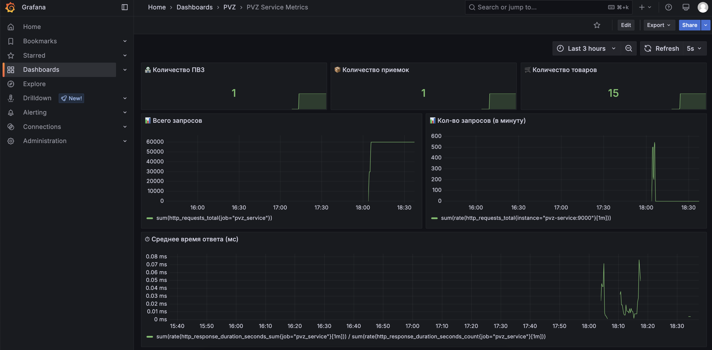

# Тестовое задание Avito Tech Spring 25

## Содержание

1. [Описание задания](#описание-задания)
2. [Запуск сервиса](#запуск-сервиса)
3. [Таблица прогресса](#таблица-прогресса)
4. [Детали реализации](#детали-реализации)
5. [Вопросы по заданию, возникшие во время разработки](#вопросы-по-заданию-возникшие-во-время-разработки)
6. [Дальнейшее развитие](#дальнейшее-развитие)

## Описание задания

### Проблема

На ПВЗ несколько раз в день привозят новые товары, которые были заказаны через Авито.
Прежде чем их отдавать заказчику, необходимо сначала проверить и внести информацию в базу.
Из-за того, что ПВЗ много, а товаров ещё больше, нужно реализовать механизм, позволяющий в разрезе каждого ПВЗ увидеть,
сколько раз в день к ним приезжали товары на приёмку и какие товары были получены.

### Описание задачи

Необходимо разработать backend-сервис для сотрудников ПВЗ, который позволит вносить информацию по заказам в рамках
приёмки товаров.

1. Авторизация пользователей:
    * Используя ручку /dummyLogin и передав в неё желаемый тип пользователя (client, moderator),
      сервис в ответе вернёт токен с соответствующим уровнем доступа — обычного пользователя или модератора.
      Этот токен нужно передавать во все endpoints, требующие авторизации.

2. Регистрация и авторизация пользователей по почте и паролю:
    * При регистрации используется endpoint /register.
      В базе создаётся и сохраняется новый пользователь желаемого типа: обычный пользователь (client) или модератор (
      moderator).
      У созданного пользователя появляется токен endpoint /login.
      При успешной авторизации по почте и паролю возвращается токен для пользователя с соответствующим ему уровнем
      доступа.

3. Заведение ПВЗ:
    * Только пользователь с ролью «модератор» может завести ПВЗ в системе.
    * В случае успешного запроса возвращается полная информация о созданном ПВЗ. Заведение ПВЗ возможно только в трёх
      городах: Москва, Санкт-Петербург и Казань. В других городах ПВЗ завести на первых порах нельзя, в таком случае
      необходимо вернуть ошибку.
    * Результатом добавления ПВЗ должна стать новая запись в хранилище данных

4. Добавление информации о приёмке товаров:
    * Только авторизованный пользователь системы с ролью «сотрудник ПВЗ» может инициировать приём товара.
    * Результатом инициации приёма товаров должна стать новая запись в хранилище данных.
    * Если же предыдущая приёмка товара не была закрыта, то операция по созданию нового приёма товаров невозможна.

5. Добавление товаров в рамках одной приёмки:
    * Только авторизованный пользователь системы с ролью «сотрудник ПВЗ» может добавлять товары после его осмотра.
    * При этом товар должен привязываться к последнему незакрытому приёму товаров в рамках текущего ПВЗ.
    * Если же нет новой незакрытой приёмки товаров, то в таком случае должна возвращаться ошибка, и товар не должен
      добавляться в систему.
    * Если последняя приёмка товара все ещё не была закрыта, то результатом должна стать привязка товара к текущему ПВЗ
      и текущей приёмке с последующем добавлением данных в хранилище.

6. Удаление товаров в рамках не закрытой приёмки:
    * Только авторизованный пользователь системы с ролью «сотрудник ПВЗ» может удалять товары, которые были добавлены
      в рамках текущей приёмки на ПВЗ.
    * Удаление товара возможно только до закрытия приёмки, после этого уже невозможно изменить состав товаров, которые
      были приняты на ПВЗ.
    * Удаление товаров производится по принципу LIFO, т.е. возможно удалять товары только в том порядке, в котором
      они были добавлены в рамках текущей приёмки.

7. Закрытие приёмки:
    * Только авторизованный пользователь системы с ролью «сотрудник ПВЗ» может закрывать приём товаров.
    * В случае, если приёмка товаров уже была закрыта (или приёма товаров в данном ПВЗ ещё не было),
      то следует вернуть ошибку.
    * Во всех остальных случаях необходимо обновить данные в хранилище и зафиксировать товары,
      которые были в рамках этой приёмки.

8. Получение данных:
    * Только авторизованный пользователь системы с ролью «сотрудник ПВЗ» или «модератор» может получать эти данные.
    * Необходимо получить список ПВЗ и всю информацию по ним при помощи пагинации.
    * При этом добавить фильтр по дате приёмки товаров, т.е. выводить только те ПВЗ и всю информацию по ним

### Общие вводные

У сущности «Пункт приёма заказов (ПВЗ)» есть:

* Уникальный идентификатор
* Дата регистрации в системе
* Город

У сущности «Приёмка товара» есть:

* Уникальный идентификатор
* Дата и время проведения приёмки
* ПВЗ, в котором была осуществлена приёмка
* Товары, которые были приняты в рамках данной приёмки
* Статус (in_progress, close)

У сущности «Товар» есть:

* Уникальный идентификатор
* Дата и время приёма товара (дата и время, когда товар был добавлен в систему в рамках приёмки товаров)
* Тип (мы работаем с тремя типами товаров: электроника, одежда, обувь)

## Запуск сервиса

Сначала необходимо склонировать репозиторий и перейти в директорию:

```bash
https://github.com/hamillka/avitoTechSpring25.git
cd avitoTechSpring25
```

Для деплоя реализован [docker-файл](./Dockerfile) и использован [docker-compose](./docker-compose.yml).
Вместе с сервисом поднимается БД в отдельном контейнере.
Также вместе с основным сервисом будут подняты: gRPC-сервис, Prometheus и Grafana.
Для gRPC-сервиса описан отдельный [docker-файл](./Dockerfile.grpc).

Для запуска нужно выполнить следующую команду:

```bash
docker-compose up
```

Для удобства написан [make-файл](./Makefile). С помощью команды `make run` можно запустить все сервисы.

HTTP-сервис будет запущен на localhost с портом 8080.
gRPC-сервис будет запущен на localhost с портом 3000.

## Таблица прогресса

| Задача                                            | Прогресс | Комментарий                                                                                                                                                                                                                                                                |
|---------------------------------------------------|:--------:|----------------------------------------------------------------------------------------------------------------------------------------------------------------------------------------------------------------------------------------------------------------------------|
| **Заведение ПВЗ**                                 |    ✅     |                                                                                                                                                                                                                                                                            |
| **Добавление информации о приёмке товаров**       |    ✅     |                                                                                                                                                                                                                                                                            |
| **Добавление товаров в рамках одной приёмки**     |    ✅     |                                                                                                                                                                                                                                                                            |
| **Удаление товаров в рамках не закрытой приёмки** |    ✅     |                                                                                                                                                                                                                                                                            |
| **Закрытие приёмки**                              |    ✅     |                                                                                                                                                                                                                                                                            |
| **Получение данных**                              |    ✅     |                                                                                                                                                                                                                                                                            |
| **Авторизация**                                   |    ✅     | Реализованы ручки `/login` и `/register` для полноценного входа в систему и ручка `/dummyLogin` для упрощенного входа. <br/>Реализован middleware, который проверяет JWT-токен, переданный в Header\'е с именем `auth-x`, и разрешает или запрещает действие пользователю. |
| **gRPC**                                          |    ✅     | Реализован gRPC-метод, который достает информацию о ПВЗ                                                                                                                                                                                                                    |
| **Интеграционный тест**                           |    ✅     | Реализован интеграционный тест, который: создает ПВЗ, создает приемку, добавляет 50 товаров в приемку и закрывает приемку                                                                                                                                                  |
| **Unit-тесты**                                    |    ✅     | Реализованы unit-тесты хендлеров, сервисов и репозиториев. Выполнено требование по проценту покрытия                                                                                                                                                                       |
| **Запуск в docker**                               |    ✅     | Описаны Dockerfile и docker-compose.yml для запуска сервиса, для gRPC-сервера описан отдельный Dockerfile.grcp                                                                                                                                                             |
| **Нагрузочное тестирование**                      |    ✅     | Проверено, что сервис удовлетворяет нефункциональным требованиям                                                                                                                                                                                                           |
| **Prometheus + Grafana**                          |    ✅     | Добавлен сбор метрик с помощью prometheus и визуализация при помощи Grafana                                                                                                                                                                                                |
| **Линтер**                                        |    ✅     | Описана конфигурация линтера                                                                                                                                                                                                                                               |
| **Swagger**                                       |    ✅     | Добавлены комментарии для автогенерации                                                                                                                                                                                                                                    |
| **CI/CD**                                         |    ✅     | Добавлен файл [ci-cd.yaml](./.github/workflows/ci-cd.yaml), в котором описана конфигурация GitHub Actions. Запускается линтер и unit-тесты                                                                                                                                 |

## Детали реализации

- Стек: Golang, PostgreSQL, Docker
- При разработке был использован [API](./api.yaml)
- Контракт gRPC описан [здесь](./internal/grpc/pvz_v1/pvz.proto)
- Реализованы все эндпоинты, как обязательные, так и дополнительные
- В директории [tests](./tests) расположены скрипт нагрузочного тестирования и интеграционный тест (создать ПВЗ,
  добавить приемку, добавить 50 товаров в приемку, закрыть приемку)
- Unit-тесты хранятся рядом с тестируемыми сущностями
- Реализована поддержка Swagger, которая упрощает работу с API. Маршрут для Swagger: http://localhost:8080/swagger/
  Для всех методов хендлеров и всех DTO описаны комментарии, позволяющие запустить кодогенерацию с помощью
  команды `make swag-gen`
- Чтобы проверить работоспособность gRPC-метода, необходимо из корневой папки проекта выполнить
  команду `grpcurl -plaintext -proto internal/grpc/pvz_v1/pvz.proto localhost:3000 pvz.v1.PVZService/GetPVZList`,
  предварительно установив утилиту `grpcurl` (`brew install grpcurl` на MacOS)
- Полученный по ручкам /login и /dummyLogin JWT-токен нужно передавать в заголовке запроса `auth-x` как `Bearer <ВАШ-ТОКЕН>`

### База данных

На рисунке ниже представлена схема реализованной мной базы данных `pvz_service`.


### Архитектура

На следующем рисунке продемонстрирована архитектура сервиса:


Входящий запрос обрабатывается роутером, который вызывает соответствующий метод хендлера.
В каждом методе хендлере вызывается необходимый метод сервиса бизнес-логики, а в методах сервиса
вызываются методы репозиториев уровня доступа к данным.

### Линтер

В [файле](./golangci.yaml) описана конфигурация линтера, которая следит за качеством кода и помогает исправлять
логические и стилистические ошибки во время разработки.

Для запуска линтера можно воспользоваться командой `make lint`.

### Unit и интеграционный тесты

Для запуска unit-тестов достаточно выполнить команду `make unit-test`, находясь в корне проекта.
После выполнения в терминал будет выведено покрытие в процентах, а также в браузере откроется html-страница, на которой
можно посмотреть, какие строки покрыты тестами и какой процент покрытия файлов в проекте.

`
total:                                    (statements)                    77.8%
`

Для запуска интеграционного теста необходимо выполнить в терминале `make integration-test`.
Эта команда поднимет PostgreSQL в докере и запустит выполнение интеграционного теста.

Для интеграционного теста поднимается отдельный инстанс базы данных *pvz_service_test*.

### Нагрузочное тестирование

В условиях указаны нефункциональные требования:

- 1k RPS
- SLI времени ответа – 100 мс
- SLI успешности ответа – 99.99%

Чтобы проверить, удовлетворяет ли система этим требованиям, было решено реализовать нагрузочное тестирование. Реализация
тестирования [здесь](./tests/load/load.js)

Тестирование проводилось на MacBook Pro 14 с процессором M1 Pro 16GB ОЗУ.

Тестирование проводилось на ручке GET /pvz. В базу данных были заранее добавлены:

- 10 ПВЗ
- По одной приемке на каждый ПВЗ
- По 10 товаров на каждую приемку

Результаты тестирования представлены на рисунке ниже:

или [в этом текстовом файле](./docs/load_results.txt)

Из представленных результатов можно сделать следующие выводы:

- 100% запросов были обработаны успешно, из чего следует, что условие про SLI успешности ответа выполнено
- По метрике `http_req_duration` и значению p(99.99)=79.54ms можно увидеть, что 99.99% запросов обработаны быстрее 100
  мс.
- Тестирование проводилось при 1k RPS (`1000 iterations/s`), все ответы пришли со статус-кодом 200, значит система
  удовлетворяет требованию в 1k RPS.

Если нужно запустить тестирование заново, нужно предварительно установить утилиту Grafana K6 (`brew install k6` для
MacOS или `sudo apt-get install k6` для Ununtu), а затем выполнить команду `make load`, находясь в корневой директории.

### Prometheus + Grafana

В систему добавлен [MetricsMiddleware](./internal/handlers/middlewares/metrics.go), который нужен, чтобы собирать
метрики, а также модуль [metrics](./internal/metrics/metrics.go), в котором описаны собираемые метрики.

Сервер для prometheus поднимается на порту 9000 и отдает метрики по ручке /metrics.
Сам prometheus поднят на порту 9090.
Для визуализации поднимается Grafana на порту 3030.
Для удобства сохранил dashboard Графаны [здесь](./grafana/dashboards/pvz_metrics.json). При поднятии графаны он
добавляется автоматически.
Логин и пароль графаны по умолчанию - `admin` и `admin`

Дашборд:


## Вопросы по заданию, возникшие во время разработки

- Из условия не совсем понятно, к каким данным должен применяться фильтр по дате при вызове ручки GET /pvz: к дате
  регистрации приемки или к факту добавления товара в приемку.
  Мной было принято решение применять фильтр именно к фактическому поступлению товара в приемку.
  При этом реализовано было так: если фильтр по дате не установлен, то выводится вся информация по всем ПВЗ, приемкам и
  товарам.
  Если же фильтр по дате установлен, то выводятся только те ПВЗ и приемки, в которые были добавлены товары в этот
  промежуток времени.

- Также не было ясности по поводу валидации параметров limit и page в этом же эндпоинте.
  *Если пользователь ввел параметр больше разрешенного максимума/минимума, следует менять его значение на значение
  по-умолчанию или возвращать ошибку?*
  Я принял решение возвращать BadRequest (400) статус-код и принимать это за ошибку пользователя.

- При реализации логики этого же эндпоинта возникла проблема N+1 из-за множественных запросов в базу данных.
  Она исправлена в коммите [#1cb2dc0](https://github.com/hamillka/avitoTechSpring25/commit/1cb2dc009f871f443334356589836a5a60bc243b).
  Эта проблема влияла на производительность сервиса и не позволяла уложиться в установленные нефункциональные
  требования.

- Также из условия не совсем ясно, в чем отличие роли Обычный пользователь от Сотрудник. Было принято решение использовать две роли: модератор (moderator) и сотрудник ПВЗ (employee)

## Дальнейшее развитие

- Оптимизировать запросы к БД
- Возможно, добавить кэширование запросов
- Увеличить процент тестового покрытия кода до 80-85%
